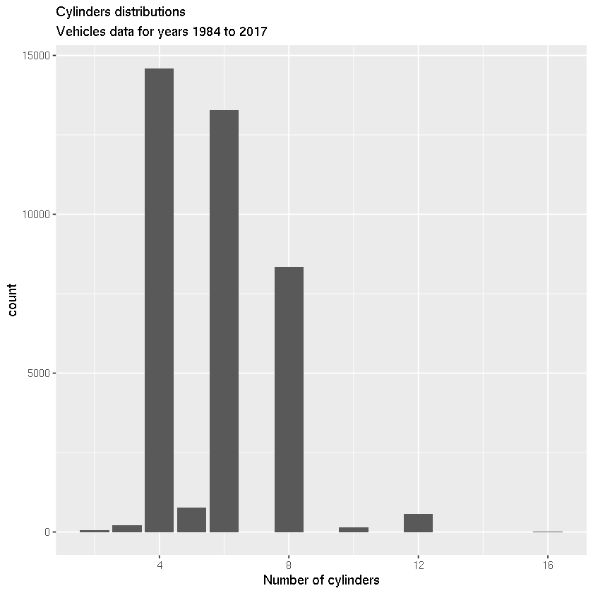
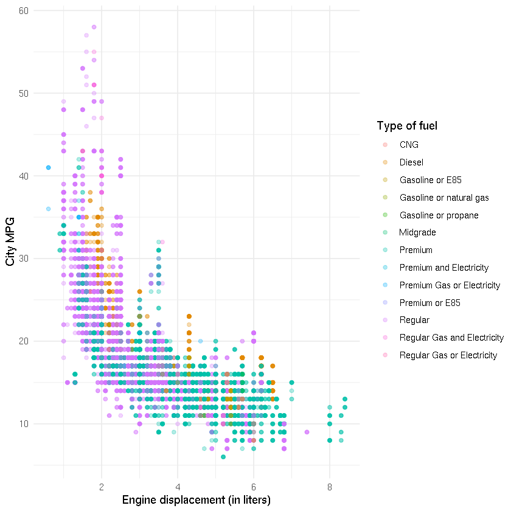
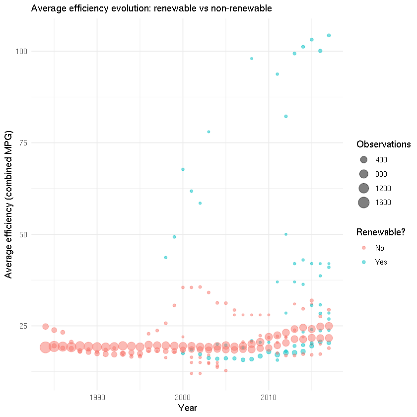
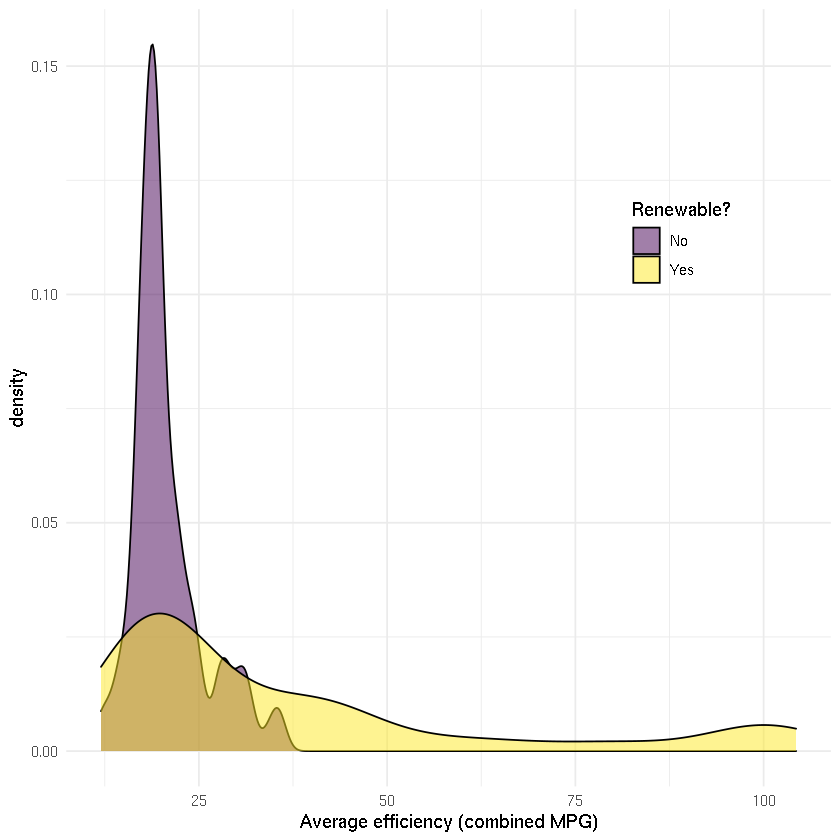
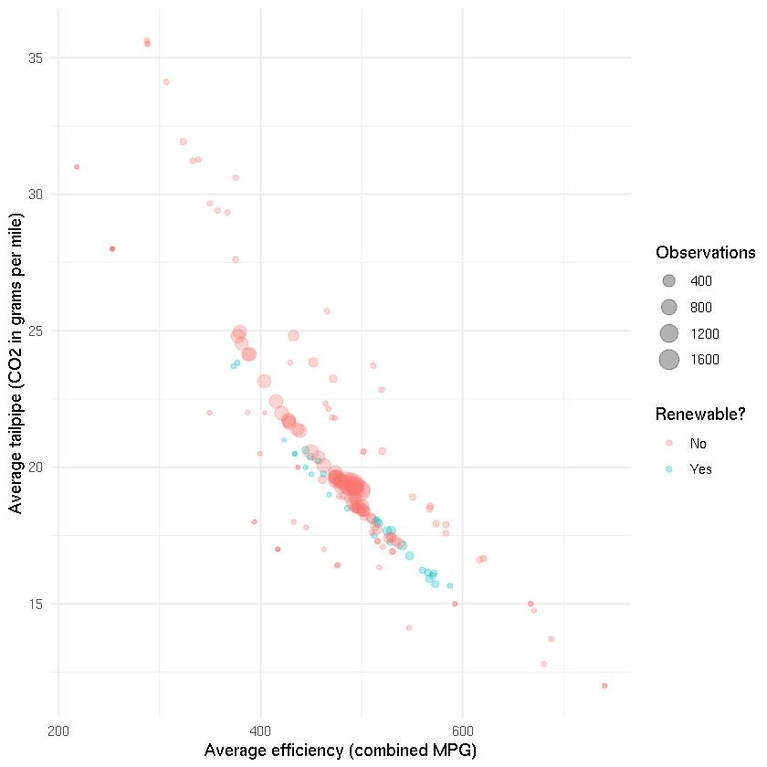
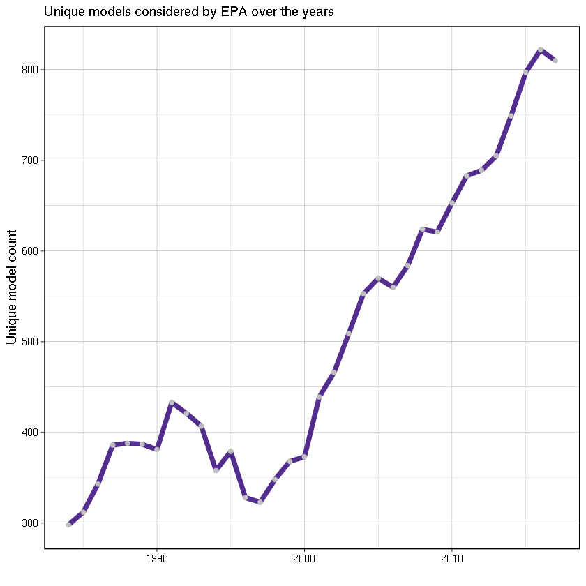

# Vehicle Fuel Economy Estimates Data Set


_Use this notebook to practice your exploratory data analysis and visualization skills._

<div class="alert alert-block alert-success"  style="display:inline-block;" markdown="1">

**EXPLORE:** Click on the <kbd> Edit App </kbd> button in the top right corner of this page, to interact with this Jupyter notebook
<br><br>
To navigate through **this notebook** simply press the <kbd>shift</kbd> + <kbd>Enter</kbd> keys to run each **block of code**. 

You can include new blocks of code or text throughout the notebook to continue exploring and programming with R. 
</div>

(New to Jupyter notebooks? See the [help page](https://nbviewer.jupyter.org/github/ipython/ipython/blob/3.x/examples/Notebook/Index.ipynb) for more on working with Jupyter notebooks)

<div class="alert alert-block alert-warning" style="display:inline-block;" markdown="1">

The **original dataset** is obtained from FuelEconomy.gov Web Services. The 1984-2017 fuel economy data is produced during vehicle testing at the **Environmental Protection Agency's (EPA) National Vehicle and Fuel Emissions Laboratory** in Ann Arbor, Michigan, and by vehicle manufacturers with EPA oversight. Check also the data in this [Kaggle page](https://www.kaggle.com/epa/fuel-economy).


The version of the data used in this notebook is also available in [this repo](https://github.com/reisanar/datasets/blob/master/fuel.csv).
</div>

## Load packages


```R
# use data science tools from the tidyverse
library(tidyverse)
```

## Read the data

The adapted dataset used in this notebook contains  more than 38,000 observations and 81 variables are available! (We will focus on a small subset of the attributes for this initial exploration). A related data dictionary can be found at https://www.fueleconomy.gov/feg/ws/

EPA's fuel economy values are good estimates of the fuel economy a typical driver will achieve under average driving conditions and provide a good basis to compare one vehicle to another. Fuel economy varies, sometimes significantly, based on driving conditions, driving style, and other factors.

Below we read the `.csv` file using `readr::read_csv()` (the `readr` package is part of the `tidyverse`)


```R
fuel <- read_csv("../data/fuel.csv", col_types = cols())
```

Check the dimensions of the dataset:


```R
dim(fuel)
```


<ol class=list-inline>
	<li>38113</li>
	<li>81</li>
</ol>


## Data Exploration


```R
# random sample of the data
set.seed(217)      # this sets a random seed for reproducibility
fuel %>%
   sample_n(7)
```


<table>
<thead><tr><th scope=col>vehicle_id</th><th scope=col>year</th><th scope=col>make</th><th scope=col>model</th><th scope=col>class</th><th scope=col>drive</th><th scope=col>transmission</th><th scope=col>transmission_type</th><th scope=col>engine_index</th><th scope=col>engine_descriptor</th><th scope=col>⋯</th><th scope=col>hours_to_charge_ac_240v</th><th scope=col>composite_city_mpg</th><th scope=col>composite_highway_mpg</th><th scope=col>composite_combined_mpg</th><th scope=col>range_ft1</th><th scope=col>city_range_ft1</th><th scope=col>highway_range_ft1</th><th scope=col>range_ft2</th><th scope=col>city_range_ft2</th><th scope=col>highway_range_ft2</th></tr></thead>
<tbody>
	<tr><td>13264                      </td><td>1997                       </td><td>Honda                      </td><td>Del Sol                    </td><td>Two Seaters                </td><td>Front-Wheel Drive          </td><td>Manual 5-Speed             </td><td>NA                         </td><td>26010                      </td><td>VTEC       (FFS)           </td><td>⋯                          </td><td>0                          </td><td>0                          </td><td>0                          </td><td>0                          </td><td>0                          </td><td>0                          </td><td>0                          </td><td>NA                         </td><td>0                          </td><td>0                          </td></tr>
	<tr><td> 4074                      </td><td>1987                       </td><td>Jeep                       </td><td>Cherokee/Wagoneer 4WD      </td><td>Special Purpose Vehicles   </td><td>4-Wheel or All-Wheel Drive </td><td>Manual 4-Speed             </td><td>SIL                        </td><td> 1998                      </td><td>(FFS)      (SPFI)          </td><td>⋯                          </td><td>0                          </td><td>0                          </td><td>0                          </td><td>0                          </td><td>0                          </td><td>0                          </td><td>0                          </td><td>NA                         </td><td>0                          </td><td>0                          </td></tr>
	<tr><td> 8495                      </td><td>1991                       </td><td>Ford                       </td><td>Bronco 4WD                 </td><td>Special Purpose Vehicles   </td><td>4-Wheel or All-Wheel Drive </td><td>Automatic 4-Speed          </td><td>NA                         </td><td> 3824                      </td><td>(FFS)                      </td><td>⋯                          </td><td>0                          </td><td>0                          </td><td>0                          </td><td>0                          </td><td>0                          </td><td>0                          </td><td>0                          </td><td>NA                         </td><td>0                          </td><td>0                          </td></tr>
	<tr><td>32292                      </td><td>2012                       </td><td>Porsche                    </td><td>New 911 Carrera S          </td><td>Minicompact Cars           </td><td>Rear-Wheel Drive           </td><td>Auto(AM-S7)                </td><td>NA                         </td><td>  106                      </td><td>SIDI                       </td><td>⋯                          </td><td>0                          </td><td>0                          </td><td>0                          </td><td>0                          </td><td>0                          </td><td>0                          </td><td>0                          </td><td>NA                         </td><td>0                          </td><td>0                          </td></tr>
	<tr><td> 1038                      </td><td>1985                       </td><td>Chevrolet                  </td><td>S10 Blazer 2WD             </td><td>Special Purpose Vehicle 2WD</td><td>Rear-Wheel Drive           </td><td>Manual 4-Speed             </td><td>SIL                        </td><td> 4808                      </td><td>(FFS)                      </td><td>⋯                          </td><td>0                          </td><td>0                          </td><td>0                          </td><td>0                          </td><td>0                          </td><td>0                          </td><td>0                          </td><td>NA                         </td><td>0                          </td><td>0                          </td></tr>
	<tr><td>23313                      </td><td>2007                       </td><td>Audi                       </td><td>S4 Avant                   </td><td>Small Station Wagons       </td><td>4-Wheel or All-Wheel Drive </td><td>Automatic (S6)             </td><td>3MODE CLKUP                </td><td>    0                      </td><td>NA                         </td><td>⋯                          </td><td>0                          </td><td>0                          </td><td>0                          </td><td>0                          </td><td>0                          </td><td>0                          </td><td>0                          </td><td>NA                         </td><td>0                          </td><td>0                          </td></tr>
	<tr><td>24783                      </td><td>2008                       </td><td>BMW                        </td><td>335ci                      </td><td>Subcompact Cars            </td><td>Rear-Wheel Drive           </td><td>Manual 6-Speed             </td><td>NA                         </td><td>    0                      </td><td>NA                         </td><td>⋯                          </td><td>0                          </td><td>0                          </td><td>0                          </td><td>0                          </td><td>0                          </td><td>0                          </td><td>0                          </td><td>NA                         </td><td>0                          </td><td>0                          </td></tr>
</tbody>
</table>


We can see the range (minimum and maximum) of a variable using the `range()` function: 


```R
range(fuel$year)
```


<ol class=list-inline>
	<li>1984</li>
	<li>2017</li>
</ol>


We can also use the `dplyr::sumarize()` function to get some summaries for certain variables:


```R
fuel %>%
  summarize(minmax_year = range(year), 
            minmax_fuel_cost = range(annual_fuel_cost_ft1), 
            minmax_barrels = range(annual_consumption_in_barrels_ft1))
```


<table>
<thead><tr><th scope=col>minmax_year</th><th scope=col>minmax_fuel_cost</th><th scope=col>minmax_barrels</th></tr></thead>
<tbody>
	<tr><td>1984    </td><td> 500    </td><td> 0.06000</td></tr>
	<tr><td>2017    </td><td>6050    </td><td>47.08714</td></tr>
</tbody>
</table>


For variables that are encoded as categorical, we can also get counts. First, below is a trick to find which variables are encoded as _character_ (this will help you determine which ones are actually categorical variables: for example an email is stored as a character, but we may not treat is a category since it may be unique, while colors and brands could be treated as categorical):


```R
# select variables that are of type character
fuel %>%
   select_if(is.character)
```


<table>
<thead><tr><th scope=col>make</th><th scope=col>model</th><th scope=col>class</th><th scope=col>drive</th><th scope=col>transmission</th><th scope=col>transmission_type</th><th scope=col>engine_descriptor</th><th scope=col>fuel_type</th><th scope=col>fuel_type_1</th><th scope=col>my_mpg_data</th><th scope=col>alternative_fuel_technology</th></tr></thead>
<tbody>
	<tr><td>Alfa Romeo                 </td><td>GT V6 2.5                  </td><td>Minicompact Cars           </td><td>NA                         </td><td>Manual 5-Speed             </td><td>NA                         </td><td>(FFS)                      </td><td>Regular                    </td><td>Regular Gasoline           </td><td>N                          </td><td>NA                         </td></tr>
	<tr><td>Alfa Romeo                 </td><td>GT V6 2.5                  </td><td>Minicompact Cars           </td><td>NA                         </td><td>Manual 5-Speed             </td><td>NA                         </td><td>(FFS) CA model             </td><td>Regular                    </td><td>Regular Gasoline           </td><td>N                          </td><td>NA                         </td></tr>
	<tr><td>Alfa Romeo                 </td><td>Spider Veloce 2000         </td><td>Two Seaters                </td><td>NA                         </td><td>Manual 5-Speed             </td><td>NA                         </td><td>(FFS)                      </td><td>Regular                    </td><td>Regular Gasoline           </td><td>N                          </td><td>NA                         </td></tr>
	<tr><td>Alfa Romeo                 </td><td>Spider Veloce 2000         </td><td>Two Seaters                </td><td>NA                         </td><td>Manual 5-Speed             </td><td>NA                         </td><td>(FFS) CA model             </td><td>Regular                    </td><td>Regular Gasoline           </td><td>N                          </td><td>NA                         </td></tr>
	<tr><td>AM General                 </td><td>DJ Po Vehicle 2WD          </td><td>Special Purpose Vehicle 2WD</td><td>2-Wheel Drive              </td><td>Automatic 3-Speed          </td><td>NA                         </td><td>(FFS)                      </td><td>Regular                    </td><td>Regular Gasoline           </td><td>N                          </td><td>NA                         </td></tr>
	<tr><td>AM General                 </td><td>DJ Po Vehicle 2WD          </td><td>Special Purpose Vehicle 2WD</td><td>2-Wheel Drive              </td><td>Automatic 3-Speed          </td><td>NA                         </td><td>(FFS) CA model             </td><td>Regular                    </td><td>Regular Gasoline           </td><td>N                          </td><td>NA                         </td></tr>
	<tr><td>AM General                 </td><td>FJ8c Post Office           </td><td>Special Purpose Vehicle 2WD</td><td>2-Wheel Drive              </td><td>Automatic 3-Speed          </td><td>NA                         </td><td>(FFS)                      </td><td>Regular                    </td><td>Regular Gasoline           </td><td>N                          </td><td>NA                         </td></tr>
	<tr><td>AM General                 </td><td>FJ8c Post Office           </td><td>Special Purpose Vehicle 2WD</td><td>2-Wheel Drive              </td><td>Automatic 3-Speed          </td><td>NA                         </td><td>(FFS) CA model             </td><td>Regular                    </td><td>Regular Gasoline           </td><td>N                          </td><td>NA                         </td></tr>
	<tr><td>American Motors Corporation</td><td>Eagle 4WD                  </td><td>Special Purpose Vehicle 4WD</td><td>4-Wheel or All-Wheel Drive </td><td>Automatic 3-Speed          </td><td>NA                         </td><td>(FFS)                      </td><td>Regular                    </td><td>Regular Gasoline           </td><td>N                          </td><td>NA                         </td></tr>
	<tr><td>American Motors Corporation</td><td>Eagle 4WD                  </td><td>Special Purpose Vehicle 4WD</td><td>4-Wheel or All-Wheel Drive </td><td>Automatic 3-Speed          </td><td>NA                         </td><td>(FFS) CA model             </td><td>Regular                    </td><td>Regular Gasoline           </td><td>N                          </td><td>NA                         </td></tr>
	<tr><td>American Motors Corporation</td><td>Eagle 4WD                  </td><td>Special Purpose Vehicle 4WD</td><td>4-Wheel or All-Wheel Drive </td><td>Manual 4-Speed             </td><td>NA                         </td><td>(FFS)                      </td><td>Regular                    </td><td>Regular Gasoline           </td><td>N                          </td><td>NA                         </td></tr>
	<tr><td>American Motors Corporation</td><td>Eagle 4WD                  </td><td>Special Purpose Vehicle 4WD</td><td>4-Wheel or All-Wheel Drive </td><td>Manual 4-Speed             </td><td>NA                         </td><td>(FFS)                      </td><td>Regular                    </td><td>Regular Gasoline           </td><td>N                          </td><td>NA                         </td></tr>
	<tr><td>American Motors Corporation</td><td>Eagle 4WD                  </td><td>Special Purpose Vehicle 4WD</td><td>4-Wheel or All-Wheel Drive </td><td>Manual 4-Speed             </td><td>NA                         </td><td>(FFS)(SIL) CA model        </td><td>Regular                    </td><td>Regular Gasoline           </td><td>N                          </td><td>NA                         </td></tr>
	<tr><td>American Motors Corporation</td><td>Eagle 4WD                  </td><td>Special Purpose Vehicle 4WD</td><td>4-Wheel or All-Wheel Drive </td><td>Manual 4-Speed             </td><td>NA                         </td><td>(FFS) CA model             </td><td>Regular                    </td><td>Regular Gasoline           </td><td>N                          </td><td>NA                         </td></tr>
	<tr><td>American Motors Corporation</td><td>Eagle 4WD                  </td><td>Special Purpose Vehicle 4WD</td><td>4-Wheel or All-Wheel Drive </td><td>Manual 5-Speed             </td><td>NA                         </td><td>(FFS)                      </td><td>Regular                    </td><td>Regular Gasoline           </td><td>N                          </td><td>NA                         </td></tr>
	<tr><td>American Motors Corporation</td><td>Eagle 4WD                  </td><td>Special Purpose Vehicle 4WD</td><td>4-Wheel or All-Wheel Drive </td><td>Manual 5-Speed             </td><td>NA                         </td><td>(FFS)                      </td><td>Regular                    </td><td>Regular Gasoline           </td><td>N                          </td><td>NA                         </td></tr>
	<tr><td>American Motors Corporation</td><td>Eagle 4WD                  </td><td>Special Purpose Vehicle 4WD</td><td>4-Wheel or All-Wheel Drive </td><td>Manual 5-Speed             </td><td>NA                         </td><td>(FFS) CA model             </td><td>Regular                    </td><td>Regular Gasoline           </td><td>N                          </td><td>NA                         </td></tr>
	<tr><td>American Motors Corporation</td><td>Eagle SX/4 4WD             </td><td>Special Purpose Vehicle 4WD</td><td>4-Wheel or All-Wheel Drive </td><td>Automatic 3-Speed          </td><td>NA                         </td><td>(FFS)                      </td><td>Regular                    </td><td>Regular Gasoline           </td><td>N                          </td><td>NA                         </td></tr>
	<tr><td>American Motors Corporation</td><td>Eagle SX/4 4WD             </td><td>Special Purpose Vehicle 4WD</td><td>4-Wheel or All-Wheel Drive </td><td>Automatic 3-Speed          </td><td>NA                         </td><td>(FFS)                      </td><td>Regular                    </td><td>Regular Gasoline           </td><td>N                          </td><td>NA                         </td></tr>
	<tr><td>American Motors Corporation</td><td>Eagle SX/4 4WD             </td><td>Special Purpose Vehicle 4WD</td><td>4-Wheel or All-Wheel Drive </td><td>Automatic 3-Speed          </td><td>NA                         </td><td>(FFS) CA model             </td><td>Regular                    </td><td>Regular Gasoline           </td><td>N                          </td><td>NA                         </td></tr>
	<tr><td>American Motors Corporation</td><td>Eagle SX/4 4WD             </td><td>Special Purpose Vehicle 4WD</td><td>4-Wheel or All-Wheel Drive </td><td>Automatic 3-Speed          </td><td>NA                         </td><td>(FFS) CA model             </td><td>Regular                    </td><td>Regular Gasoline           </td><td>N                          </td><td>NA                         </td></tr>
	<tr><td>American Motors Corporation</td><td>Eagle SX/4 4WD             </td><td>Special Purpose Vehicle 4WD</td><td>4-Wheel or All-Wheel Drive </td><td>Manual 4-Speed             </td><td>NA                         </td><td>(FFS)                      </td><td>Regular                    </td><td>Regular Gasoline           </td><td>N                          </td><td>NA                         </td></tr>
	<tr><td>American Motors Corporation</td><td>Eagle SX/4 4WD             </td><td>Special Purpose Vehicle 4WD</td><td>4-Wheel or All-Wheel Drive </td><td>Manual 4-Speed             </td><td>NA                         </td><td>(FFS)                      </td><td>Regular                    </td><td>Regular Gasoline           </td><td>N                          </td><td>NA                         </td></tr>
	<tr><td>American Motors Corporation</td><td>Eagle SX/4 4WD             </td><td>Special Purpose Vehicle 4WD</td><td>4-Wheel or All-Wheel Drive </td><td>Manual 4-Speed             </td><td>NA                         </td><td>(FFS)(SIL) CA model        </td><td>Regular                    </td><td>Regular Gasoline           </td><td>N                          </td><td>NA                         </td></tr>
	<tr><td>American Motors Corporation</td><td>Eagle SX/4 4WD             </td><td>Special Purpose Vehicle 4WD</td><td>4-Wheel or All-Wheel Drive </td><td>Manual 4-Speed             </td><td>NA                         </td><td>(FFS) CA model             </td><td>Regular                    </td><td>Regular Gasoline           </td><td>N                          </td><td>NA                         </td></tr>
	<tr><td>American Motors Corporation</td><td>Eagle SX/4 4WD             </td><td>Special Purpose Vehicle 4WD</td><td>4-Wheel or All-Wheel Drive </td><td>Manual 5-Speed             </td><td>NA                         </td><td>(FFS)                      </td><td>Regular                    </td><td>Regular Gasoline           </td><td>N                          </td><td>NA                         </td></tr>
	<tr><td>American Motors Corporation</td><td>Eagle SX/4 4WD             </td><td>Special Purpose Vehicle 4WD</td><td>4-Wheel or All-Wheel Drive </td><td>Manual 5-Speed             </td><td>NA                         </td><td>(FFS)                      </td><td>Regular                    </td><td>Regular Gasoline           </td><td>N                          </td><td>NA                         </td></tr>
	<tr><td>American Motors Corporation</td><td>Eagle SX/4 4WD             </td><td>Special Purpose Vehicle 4WD</td><td>4-Wheel or All-Wheel Drive </td><td>Manual 5-Speed             </td><td>NA                         </td><td>(FFS) CA model             </td><td>Regular                    </td><td>Regular Gasoline           </td><td>N                          </td><td>NA                         </td></tr>
	<tr><td>Aston Martin               </td><td>Lagonda                    </td><td>Subcompact Cars            </td><td>NA                         </td><td>Automatic 3-Speed          </td><td>NA                         </td><td>(GUZZLER)                  </td><td>Regular                    </td><td>Regular Gasoline           </td><td>N                          </td><td>NA                         </td></tr>
	<tr><td>Aston Martin               </td><td>Lagonda                    </td><td>Subcompact Cars            </td><td>NA                         </td><td>Automatic 3-Speed          </td><td>NA                         </td><td>(GUZZLER) CA model         </td><td>Regular                    </td><td>Regular Gasoline           </td><td>N                          </td><td>NA                         </td></tr>
	<tr><td>⋮</td><td>⋮</td><td>⋮</td><td>⋮</td><td>⋮</td><td>⋮</td><td>⋮</td><td>⋮</td><td>⋮</td><td>⋮</td><td>⋮</td></tr>
	<tr><td>Volkswagen                        </td><td>Jetta                             </td><td>Compact Cars                      </td><td>Front-Wheel Drive                 </td><td>Automatic (S6)                    </td><td>NA                                </td><td>SIDI                              </td><td>Regular                           </td><td>Regular Gasoline                  </td><td>N                                 </td><td>NA                                </td></tr>
	<tr><td>Volkswagen                        </td><td>Jetta                             </td><td>Compact Cars                      </td><td>Front-Wheel Drive                 </td><td>Manual 5-Speed                    </td><td>NA                                </td><td>SIDI                              </td><td>Regular                           </td><td>Regular Gasoline                  </td><td>N                                 </td><td>NA                                </td></tr>
	<tr><td>Volkswagen                        </td><td>Jetta                             </td><td>Compact Cars                      </td><td>Front-Wheel Drive                 </td><td>Manual 6-Speed                    </td><td>NA                                </td><td>SIDI                              </td><td>Regular                           </td><td>Regular Gasoline                  </td><td>N                                 </td><td>NA                                </td></tr>
	<tr><td>Volkswagen                        </td><td>Passat                            </td><td>Midsize Cars                      </td><td>Front-Wheel Drive                 </td><td>Auto(AM-S6)                       </td><td>NA                                </td><td>SIDI                              </td><td>Regular                           </td><td>Regular Gasoline                  </td><td>N                                 </td><td>NA                                </td></tr>
	<tr><td>Volkswagen                        </td><td>Passat                            </td><td>Midsize Cars                      </td><td>Front-Wheel Drive                 </td><td>Automatic (S6)                    </td><td>NA                                </td><td>SIDI                              </td><td>Regular                           </td><td>Regular Gasoline                  </td><td>N                                 </td><td>NA                                </td></tr>
	<tr><td>Volkswagen                        </td><td>Tiguan                            </td><td>Small Sport Utility Vehicle 2WD   </td><td>Front-Wheel Drive                 </td><td>Automatic (S6)                    </td><td>NA                                </td><td>SIDI                              </td><td>Premium                           </td><td>Premium Gasoline                  </td><td>N                                 </td><td>NA                                </td></tr>
	<tr><td>Volkswagen                        </td><td>Tiguan 4motion                    </td><td>Small Sport Utility Vehicle 4WD   </td><td>All-Wheel Drive                   </td><td>Automatic (S6)                    </td><td>NA                                </td><td>SIDI                              </td><td>Premium                           </td><td>Premium Gasoline                  </td><td>N                                 </td><td>NA                                </td></tr>
	<tr><td>Volkswagen                        </td><td>Touareg                           </td><td>Standard Sport Utility Vehicle 4WD</td><td>All-Wheel Drive                   </td><td>Automatic (S8)                    </td><td>NA                                </td><td>SIDI                              </td><td>Regular                           </td><td>Regular Gasoline                  </td><td>N                                 </td><td>NA                                </td></tr>
	<tr><td>Volvo                             </td><td>S60 AWD                           </td><td>Compact Cars                      </td><td>All-Wheel Drive                   </td><td>Automatic (S8)                    </td><td>NA                                </td><td>SIDI                              </td><td>Regular                           </td><td>Regular Gasoline                  </td><td>N                                 </td><td>NA                                </td></tr>
	<tr><td>Volvo                             </td><td>S60 AWD                           </td><td>Compact Cars                      </td><td>All-Wheel Drive                   </td><td>Automatic (S8)                    </td><td>NA                                </td><td>SIDI                              </td><td>Premium                           </td><td>Premium Gasoline                  </td><td>N                                 </td><td>NA                                </td></tr>
	<tr><td>Volvo                             </td><td>S60 CC AWD                        </td><td>Compact Cars                      </td><td>All-Wheel Drive                   </td><td>Automatic (S8)                    </td><td>NA                                </td><td>SIDI                              </td><td>Regular                           </td><td>Regular Gasoline                  </td><td>N                                 </td><td>NA                                </td></tr>
	<tr><td>Volvo                             </td><td>S60 FWD                           </td><td>Compact Cars                      </td><td>Front-Wheel Drive                 </td><td>Automatic (S8)                    </td><td>NA                                </td><td>SIDI                              </td><td>Regular                           </td><td>Regular Gasoline                  </td><td>N                                 </td><td>NA                                </td></tr>
	<tr><td>Volvo                             </td><td>S60 Inscription AWD               </td><td>Compact Cars                      </td><td>All-Wheel Drive                   </td><td>Automatic (S8)                    </td><td>NA                                </td><td>SIDI                              </td><td>Regular                           </td><td>Regular Gasoline                  </td><td>N                                 </td><td>NA                                </td></tr>
	<tr><td>Volvo                             </td><td>S60 Inscription FWD               </td><td>Compact Cars                      </td><td>Front-Wheel Drive                 </td><td>Automatic (S8)                    </td><td>NA                                </td><td>SIDI                              </td><td>Regular                           </td><td>Regular Gasoline                  </td><td>N                                 </td><td>NA                                </td></tr>
	<tr><td>Volvo                             </td><td>S60 Polestar AWD                  </td><td>Compact Cars                      </td><td>All-Wheel Drive                   </td><td>Automatic (S8)                    </td><td>NA                                </td><td>SIDI                              </td><td>Premium                           </td><td>Premium Gasoline                  </td><td>N                                 </td><td>NA                                </td></tr>
	<tr><td>Volvo                             </td><td>S90 AWD                           </td><td>Midsize Cars                      </td><td>All-Wheel Drive                   </td><td>Automatic (S8)                    </td><td>NA                                </td><td>SIDI                              </td><td>Premium                           </td><td>Premium Gasoline                  </td><td>N                                 </td><td>NA                                </td></tr>
	<tr><td>Volvo                             </td><td>S90 FWD                           </td><td>Midsize Cars                      </td><td>Front-Wheel Drive                 </td><td>Automatic (S8)                    </td><td>NA                                </td><td>SIDI                              </td><td>Premium                           </td><td>Premium Gasoline                  </td><td>N                                 </td><td>NA                                </td></tr>
	<tr><td>Volvo                             </td><td>V60 AWD                           </td><td>Small Station Wagons              </td><td>All-Wheel Drive                   </td><td>Automatic (S8)                    </td><td>NA                                </td><td>SIDI                              </td><td>Premium                           </td><td>Premium Gasoline                  </td><td>N                                 </td><td>NA                                </td></tr>
	<tr><td>Volvo                             </td><td>V60 AWD                           </td><td>Small Station Wagons              </td><td>All-Wheel Drive                   </td><td>Automatic (S8)                    </td><td>NA                                </td><td>SIDI                              </td><td>Regular                           </td><td>Regular Gasoline                  </td><td>N                                 </td><td>NA                                </td></tr>
	<tr><td>Volvo                             </td><td>V60 CC AWD                        </td><td>Small Station Wagons              </td><td>All-Wheel Drive                   </td><td>Automatic (S8)                    </td><td>NA                                </td><td>SIDI                              </td><td>Regular                           </td><td>Regular Gasoline                  </td><td>N                                 </td><td>NA                                </td></tr>
	<tr><td>Volvo                             </td><td>V60 FWD                           </td><td>Small Station Wagons              </td><td>Front-Wheel Drive                 </td><td>Automatic (S8)                    </td><td>NA                                </td><td>SIDI                              </td><td>Regular                           </td><td>Regular Gasoline                  </td><td>N                                 </td><td>NA                                </td></tr>
	<tr><td>Volvo                             </td><td>V60 Polestar AWD                  </td><td>Small Station Wagons              </td><td>All-Wheel Drive                   </td><td>Automatic (S8)                    </td><td>NA                                </td><td>SIDI                              </td><td>Premium                           </td><td>Premium Gasoline                  </td><td>N                                 </td><td>NA                                </td></tr>
	<tr><td>Volvo                             </td><td>V90 CC AWD                        </td><td>Midsize Station Wagons            </td><td>All-Wheel Drive                   </td><td>Automatic (S8)                    </td><td>NA                                </td><td>SIDI                              </td><td>Premium                           </td><td>Premium Gasoline                  </td><td>N                                 </td><td>NA                                </td></tr>
	<tr><td>Volvo                             </td><td>XC60 AWD                          </td><td>Small Sport Utility Vehicle 4WD   </td><td>All-Wheel Drive                   </td><td>Automatic (S8)                    </td><td>NA                                </td><td>SIDI                              </td><td>Premium                           </td><td>Premium Gasoline                  </td><td>N                                 </td><td>NA                                </td></tr>
	<tr><td>Volvo                             </td><td>XC60 AWD                          </td><td>Small Sport Utility Vehicle 4WD   </td><td>All-Wheel Drive                   </td><td>Automatic (S8)                    </td><td>NA                                </td><td>SIDI                              </td><td>Regular                           </td><td>Regular Gasoline                  </td><td>N                                 </td><td>NA                                </td></tr>
	<tr><td>Volvo                             </td><td>XC60 FWD                          </td><td>Small Sport Utility Vehicle 2WD   </td><td>Front-Wheel Drive                 </td><td>Automatic (S8)                    </td><td>NA                                </td><td>SIDI                              </td><td>Regular                           </td><td>Regular Gasoline                  </td><td>N                                 </td><td>NA                                </td></tr>
	<tr><td>Volvo                             </td><td>XC90 AWD                          </td><td>Standard Sport Utility Vehicle 4WD</td><td>All-Wheel Drive                   </td><td>Automatic (S8)                    </td><td>NA                                </td><td>SIDI                              </td><td>Premium                           </td><td>Premium Gasoline                  </td><td>N                                 </td><td>NA                                </td></tr>
	<tr><td>Volvo                             </td><td>XC90 AWD                          </td><td>Standard Sport Utility Vehicle 4WD</td><td>All-Wheel Drive                   </td><td>Automatic (S8)                    </td><td>NA                                </td><td>SIDI                              </td><td>Premium                           </td><td>Premium Gasoline                  </td><td>N                                 </td><td>NA                                </td></tr>
	<tr><td>Volvo                             </td><td>XC90 AWD PHEV                     </td><td>Standard Sport Utility Vehicle 4WD</td><td>All-Wheel Drive                   </td><td>Automatic (S8)                    </td><td>NA                                </td><td>SIDI; PHEV                        </td><td>Premium and Electricity           </td><td>Premium Gasoline                  </td><td>N                                 </td><td>Plug-in Hybrid                    </td></tr>
	<tr><td>Volvo                             </td><td>XC90 FWD                          </td><td>Standard Sport Utility Vehicle 2WD</td><td>Front-Wheel Drive                 </td><td>Automatic (S8)                    </td><td>NA                                </td><td>SIDI                              </td><td>Premium                           </td><td>Premium Gasoline                  </td><td>N                                 </td><td>NA                                </td></tr>
</tbody>
</table>


Let us select check the number of observations for each class of vehicle (`class`)


```R
fuel %>%
  group_by(class) %>%
  count()
# you could also use group_by() followed by summarize() where the 
# summary counts the number of rows using the n() function
```


<table>
<thead><tr><th scope=col>class</th><th scope=col>n</th></tr></thead>
<tbody>
	<tr><td>Compact Cars                      </td><td>5508                              </td></tr>
	<tr><td>Large Cars                        </td><td>1891                              </td></tr>
	<tr><td>Midsize Cars                      </td><td>4395                              </td></tr>
	<tr><td>Midsize Station Wagons            </td><td> 523                              </td></tr>
	<tr><td>Midsize-Large Station Wagons      </td><td> 656                              </td></tr>
	<tr><td>Minicompact Cars                  </td><td>1260                              </td></tr>
	<tr><td>Minivan - 2WD                     </td><td> 342                              </td></tr>
	<tr><td>Minivan - 4WD                     </td><td>  47                              </td></tr>
	<tr><td>Small Pickup Trucks               </td><td> 538                              </td></tr>
	<tr><td>Small Pickup Trucks 2WD           </td><td> 436                              </td></tr>
	<tr><td>Small Pickup Trucks 4WD           </td><td> 218                              </td></tr>
	<tr><td>Small Sport Utility Vehicle 2WD   </td><td> 403                              </td></tr>
	<tr><td>Small Sport Utility Vehicle 4WD   </td><td> 526                              </td></tr>
	<tr><td>Small Station Wagons              </td><td>1499                              </td></tr>
	<tr><td>Special Purpose Vehicle           </td><td>   1                              </td></tr>
	<tr><td>Special Purpose Vehicle 2WD       </td><td> 613                              </td></tr>
	<tr><td>Special Purpose Vehicle 4WD       </td><td> 302                              </td></tr>
	<tr><td>Special Purpose Vehicles          </td><td>1455                              </td></tr>
	<tr><td>Special Purpose Vehicles/2wd      </td><td>   2                              </td></tr>
	<tr><td>Special Purpose Vehicles/4wd      </td><td>   2                              </td></tr>
	<tr><td>Sport Utility Vehicle - 2WD       </td><td>1627                              </td></tr>
	<tr><td>Sport Utility Vehicle - 4WD       </td><td>2082                              </td></tr>
	<tr><td>Standard Pickup Trucks            </td><td>2354                              </td></tr>
	<tr><td>Standard Pickup Trucks 2WD        </td><td>1177                              </td></tr>
	<tr><td>Standard Pickup Trucks 4WD        </td><td> 986                              </td></tr>
	<tr><td>Standard Pickup Trucks/2wd        </td><td>   4                              </td></tr>
	<tr><td>Standard Sport Utility Vehicle 2WD</td><td> 182                              </td></tr>
	<tr><td>Standard Sport Utility Vehicle 4WD</td><td> 434                              </td></tr>
	<tr><td>Subcompact Cars                   </td><td>4872                              </td></tr>
	<tr><td>Two Seaters                       </td><td>1886                              </td></tr>
	<tr><td>Vans                              </td><td>1141                              </td></tr>
	<tr><td>Vans Passenger                    </td><td>   2                              </td></tr>
	<tr><td>Vans, Cargo Type                  </td><td> 438                              </td></tr>
	<tr><td>Vans, Passenger Type              </td><td> 311                              </td></tr>
</tbody>
</table>


```R
# alternative: using the group_by + summarize combination
fuel %>%
  group_by(fuel_type) %>%
  summarize(n = n())
```


<table>
<thead><tr><th scope=col>fuel_type</th><th scope=col>n</th></tr></thead>
<tbody>
	<tr><td>CNG                        </td><td>   60                      </td></tr>
	<tr><td>Diesel                     </td><td> 1014                      </td></tr>
	<tr><td>Electricity                </td><td>  133                      </td></tr>
	<tr><td>Gasoline or E85            </td><td> 1223                      </td></tr>
	<tr><td>Gasoline or natural gas    </td><td>   20                      </td></tr>
	<tr><td>Gasoline or propane        </td><td>    8                      </td></tr>
	<tr><td>Midgrade                   </td><td>   77                      </td></tr>
	<tr><td>Premium                    </td><td>10133                      </td></tr>
	<tr><td>Premium and Electricity    </td><td>   25                      </td></tr>
	<tr><td>Premium Gas or Electricity </td><td>   18                      </td></tr>
	<tr><td>Premium or E85             </td><td>  122                      </td></tr>
	<tr><td>Regular                    </td><td>25258                      </td></tr>
	<tr><td>Regular Gas and Electricity</td><td>   20                      </td></tr>
	<tr><td>Regular Gas or Electricity </td><td>    2                      </td></tr>
</tbody>
</table>


When working with larger datasets like this one, chances are that several observations have missing values (`NA`) in some of the attributes available in the dataset. It is good practice to get a sense of the proportion of missing values for different variables. This may help you make design choices when exploring predictive models (e.g., how and what type of data imputation to incorporate - if any -, or deciding which variables have enough variation and are good choices for further analysis). 

Below is a trick to easily get this information using tools from `dplyr`:


```R
fuel %>%
  summarize_all(~sum(is.na(.))/n())
```


<table>
<thead><tr><th scope=col>vehicle_id</th><th scope=col>year</th><th scope=col>make</th><th scope=col>model</th><th scope=col>class</th><th scope=col>drive</th><th scope=col>transmission</th><th scope=col>transmission_type</th><th scope=col>engine_index</th><th scope=col>engine_descriptor</th><th scope=col>⋯</th><th scope=col>hours_to_charge_ac_240v</th><th scope=col>composite_city_mpg</th><th scope=col>composite_highway_mpg</th><th scope=col>composite_combined_mpg</th><th scope=col>range_ft1</th><th scope=col>city_range_ft1</th><th scope=col>highway_range_ft1</th><th scope=col>range_ft2</th><th scope=col>city_range_ft2</th><th scope=col>highway_range_ft2</th></tr></thead>
<tbody>
	<tr><td>0           </td><td>0           </td><td>0           </td><td>0           </td><td>0           </td><td>0.0311967   </td><td>0.0002886154</td><td>0.6052528   </td><td>0           </td><td>0.4045864   </td><td>⋯           </td><td>0           </td><td>0           </td><td>0           </td><td>0           </td><td>0           </td><td>0           </td><td>0           </td><td>1           </td><td>0           </td><td>0           </td></tr>
</tbody>
</table>


> The code above tells you that we have no missing values for the variables `year`, `make`, `model` and others; and it also indicates that the attribute `range_ft2` is an empty column (all observations have a missing value there).<br><br>
**Quick explanation**: `is.na()` returns either `TRUE` if the element is missing, and `FALSE` otherwise. When combined with the function `sum()`, any value of `TRUE` will be understood as a `1`, and instances of `FALSE` as `0` (this is known as _**coercion**_). Therefore, adding all the `1`s will tell you how many observations have a missing value, and dividing by the number of observations (i.e., using `n()`) will give the proportion. Documentation for the `summarize_all()` function (and other similar functions) can be found [here](https://dplyr.tidyverse.org/reference/summarise_all.html). 
<br><br>Again, this shows the power of `dplyr`: just a few lines of code can give you very good information.

<div class="alert alert-block alert-warning" style="display:inline-block;" markdown="1">

**Practice**: which other type of summaries can you create? Try grouping by _multiple_ variables to analyze that set of observationss (e.g., grouping by `make` and `transmission` to analyze the fuel efficiency of cars in the different groups) 

</div>

## Some data visualizations

There are many observations and attributes (variables) available in this dataset. We will generate some data visualizations in this notebook that can help us confirm some of the things we would expect from the evolution and progress made in car manufacturing in recent years.

The purpose of EPA's fuel economy estimates is to provide a reliable basis for comparing vehicles. Most vehicles in the database (other than plug-in hybrids) have three fuel economy estimates: 
- a "city" estimate that represents urban driving, in which a vehicle is started in the morning (after being parked all night) and driven in stop-and-go traffic; 

- a "highway" estimate that represents a mixture of rural and interstate highway driving in a warmed-up vehicle, typical of longer trips in free-flowing traffic; 

- and a "combined" estimate that represents a combination of city driving (55%) and highway driving (45%). Estimates for all vehicles are based on laboratory testing under standardized conditions to allow for fair comparisons.

The database also provides annual fuel cost estimates, rounded to the nearest \\$50, for each vehicle. The estimates are based on the assumptions that you travel 15,000 miles per year (55% under city driving conditions and 45% under highway conditions) and that fuel costs \\$2.33/gallon for regular unleaded gasoline, \\$2.58/gallon for mid-grade unleaded gasoline, and \\$2.82/gallon for premium.


```R
ggplot(data = fuel) + 
  geom_bar(aes(x = engine_cylinders )) + 
  labs(x = "Number of cylinders", title = "Cylinders distributions", 
      subtitle = "Vehicles data for years 1984 to 2017")
```

    Warning message:
    “Removed 136 rows containing non-finite values (stat_count).”





If you look to the far right in the above plot, you will notice some vehicles with 16 cylinders. Let us use the `dplyr::filter()` function to find those observations:


```R
fuel %>%
  filter(engine_cylinders == 16) %>%
  select(year, make, model, drive, transmission, 
         engine_cylinders, fuel_type, city_mpg_ft1)
```


<table>
<thead><tr><th scope=col>year</th><th scope=col>make</th><th scope=col>model</th><th scope=col>drive</th><th scope=col>transmission</th><th scope=col>engine_cylinders</th><th scope=col>fuel_type</th><th scope=col>city_mpg_ft1</th></tr></thead>
<tbody>
	<tr><td>2006                      </td><td>Bugatti                   </td><td>Veyron                    </td><td>4-Wheel or All-Wheel Drive</td><td>Automatic (S6)            </td><td>16                        </td><td>Premium                   </td><td>8                         </td></tr>
	<tr><td>2008                      </td><td>Bugatti                   </td><td>Veyron                    </td><td>4-Wheel or All-Wheel Drive</td><td>Automatic (S6)            </td><td>16                        </td><td>Premium                   </td><td>8                         </td></tr>
	<tr><td>2010                      </td><td>Bugatti                   </td><td>Veyron                    </td><td>All-Wheel Drive           </td><td>Automatic (S7)            </td><td>16                        </td><td>Premium                   </td><td>8                         </td></tr>
	<tr><td>2011                      </td><td>Bugatti                   </td><td>Veyron                    </td><td>All-Wheel Drive           </td><td>Automatic (S7)            </td><td>16                        </td><td>Premium                   </td><td>8                         </td></tr>
	<tr><td>2012                      </td><td>Bugatti                   </td><td>Veyron                    </td><td>All-Wheel Drive           </td><td>Automatic (S7)            </td><td>16                        </td><td>Premium                   </td><td>8                         </td></tr>
	<tr><td>2013                      </td><td>Bugatti                   </td><td>Veyron                    </td><td>All-Wheel Drive           </td><td>Auto(AM-S7)               </td><td>16                        </td><td>Premium                   </td><td>8                         </td></tr>
	<tr><td>2014                      </td><td>Bugatti                   </td><td>Veyron                    </td><td>All-Wheel Drive           </td><td>Auto(AM-S7)               </td><td>16                        </td><td>Premium                   </td><td>8                         </td></tr>
	<tr><td>2015                      </td><td>Bugatti                   </td><td>Veyron                    </td><td>All-Wheel Drive           </td><td>Auto(AM-S7)               </td><td>16                        </td><td>Premium                   </td><td>8                         </td></tr>
</tbody>
</table>


The Bugatti Veyron: million dollars cars! Learn more about this car [here](https://en.wikipedia.org/wiki/Bugatti_Veyron). 


In the set of slides for `ggplot2` we studied the relationship between the engine size (`engine_displacement`) and the fuel efficiency. Let us do something similar here:


```R
fuel %>%
  filter(engine_displacement > 0 ) %>% # make sure we have engine size values
  ggplot() + 
  geom_point(aes(x = engine_displacement, 
                 y = city_mpg_ft1, color = fuel_type), 
             alpha = 0.3) + 
  theme_minimal() + 
  labs(x = "Engine displacement (in liters)", 
       y = "City MPG", 
        color = "Type of fuel")
```





## Renewable energy

Let us aggregate data by fuel type and create a new variable called to identify if the energy source is renewable or not. We can also generate an estimate of efficiency and [tailpipe carbon dioxide](https://www.epa.gov/greenvehicles/greenhouse-gas-emissions-typical-passenger-vehicle) (CO2) (`tailpipe_co2_in_grams_mile_ft1`) averages by fuel type (`fuel_type`).

A good reference to learn more about this can be found in the (US Department of Energy) _Energy Efficiency and Renewable Energy_ page: https://afdc.energy.gov/fuels/


```R
fuel %>%
  group_by(fuel_type) %>%
  count()
```


<table>
<thead><tr><th scope=col>fuel_type</th><th scope=col>n</th></tr></thead>
<tbody>
	<tr><td>CNG                        </td><td>   60                      </td></tr>
	<tr><td>Diesel                     </td><td> 1014                      </td></tr>
	<tr><td>Electricity                </td><td>  133                      </td></tr>
	<tr><td>Gasoline or E85            </td><td> 1223                      </td></tr>
	<tr><td>Gasoline or natural gas    </td><td>   20                      </td></tr>
	<tr><td>Gasoline or propane        </td><td>    8                      </td></tr>
	<tr><td>Midgrade                   </td><td>   77                      </td></tr>
	<tr><td>Premium                    </td><td>10133                      </td></tr>
	<tr><td>Premium and Electricity    </td><td>   25                      </td></tr>
	<tr><td>Premium Gas or Electricity </td><td>   18                      </td></tr>
	<tr><td>Premium or E85             </td><td>  122                      </td></tr>
	<tr><td>Regular                    </td><td>25258                      </td></tr>
	<tr><td>Regular Gas and Electricity</td><td>   20                      </td></tr>
	<tr><td>Regular Gas or Electricity </td><td>    2                      </td></tr>
</tbody>
</table>


Below we use `dplyr::mutate()` to create a new column, based on the value of `fuel_type` containing the word "Electricity" or "E85". This is done with the help of the `str_detect()` function from the `stringr` package (part of the `tidyverse`)


```R
fuel %>%
  mutate(renewable = case_when(
           str_detect(fuel_type, pattern = "Elect") ~ "Yes", 
           str_detect(fuel_type, pattern = "E85") ~ "Yes", 
           TRUE ~ "No"
          )
        ) %>%
  group_by(renewable) %>%
  count()
```


<table>
<thead><tr><th scope=col>renewable</th><th scope=col>n</th></tr></thead>
<tbody>
	<tr><td>No   </td><td>36570</td></tr>
	<tr><td>Yes  </td><td> 1543</td></tr>
</tbody>
</table>


```R
# average tailpipe_co2_in_grams_mile_ft1
fuel %>%
  mutate(renewable = case_when(
           str_detect(fuel_type, pattern = "Elect") ~ "Yes", 
           str_detect(fuel_type, pattern = "E85") ~ "Yes", 
           TRUE ~ "No"
          )
        ) %>%
  group_by(renewable) %>%
  summarize(average_co2 = mean(tailpipe_co2_in_grams_mile_ft1, na.rm = T), 
            average_efficiency = mean(combined_mpg_ft1, na.rm = T))
```


<table>
<thead><tr><th scope=col>renewable</th><th scope=col>average_co2</th><th scope=col>average_efficiency</th></tr></thead>
<tbody>
	<tr><td>No      </td><td>473.3132</td><td>20.01709</td></tr>
	<tr><td>Yes     </td><td>459.6839</td><td>24.93195</td></tr>
</tbody>
</table>


We will create a simple plot comparing the available observations and the variable `renewable`:


```R
# create auxiliary dataframe with summaries
fuel_ave <- fuel %>%
  mutate(renewable = case_when(
           str_detect(fuel_type, pattern = "Elect") ~ "Yes", 
           str_detect(fuel_type, pattern = "E85") ~ "Yes", 
           TRUE ~ "No"
          )
        ) %>%
  group_by(fuel_type, year, renewable) %>%
  summarize(average_co2 = mean(tailpipe_co2_in_grams_mile_ft1, na.rm = T), 
            average_efficiency = mean(combined_mpg_ft1, na.rm = T), 
            quantity = n(), 
           .groups = "drop")
```


```R
ggplot(data = fuel_ave) + 
  geom_point(aes(x = year, y = average_efficiency, 
                 color = renewable, size = quantity), 
             alpha = 0.5) + 
  labs(x = "Year", y = "Average efficiency (combined MPG)", 
       title = "Average efficiency evolution: renewable vs non-renewable", 
       color = "Renewable?", size = "Observations") + 
  theme_minimal()
```





We can also check density plots:


```R
ggplot(data = fuel_ave) + 
  geom_density(aes(x = average_efficiency, fill = renewable), 
             alpha = 0.5) + 
  labs(x = "Average efficiency (combined MPG)", 
       fill = "Renewable?") + 
  scale_fill_viridis_d() + 
  theme_minimal() + 
  theme(legend.position = c(0.8,0.7)) # adjust the legend position
```





Finally, we analyze the relationship between gas emissions and fuel efficiency (ignoring electric cars):


```R
fuel_ave %>% 
  filter(!str_detect(fuel_type, "Elect")) %>%
  ggplot() + 
  geom_point(aes(x = average_co2, y = average_efficiency, 
                 color = renewable, size = quantity), 
             alpha = 0.3) + 
  labs(x = "Average efficiency (combined MPG)", 
       y = "Average tailpipe (CO2 in grams per mile)", 
       color = "Renewable?", size = "Observations") + 
  theme_minimal()
```





<div class="alert alert-block alert-warning" style="display:inline-block;" markdown="1">

**Practice**: explore the relationship between other variables. Can you characterize the trends you observe? How about the number of unique models over the years? 

</div>


```R
# sample solution: notice the custom colors using HEX codes
fuel %>%
  group_by(year) %>%
  summarize(diff_model = length(unique(model)) 
            ) %>%
  ggplot(aes(x = year, y = diff_model)) + 
  geom_line(color = "#532d8e", size = 2) + 
  geom_point(color = "grey") + 
  labs(x = "",  y = "Unique model count", 
       title = "Unique models considered by EPA over the years") + 
  theme_linedraw()
```





<div class="alert alert-block alert-success" markdown="1">

**Success!** You can now return to the main page to continue learning.

</div>
